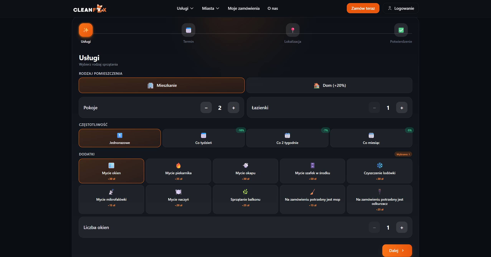
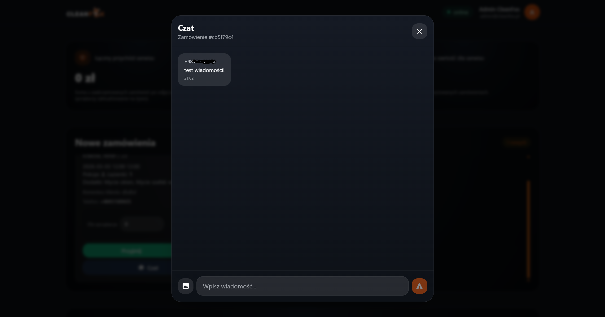
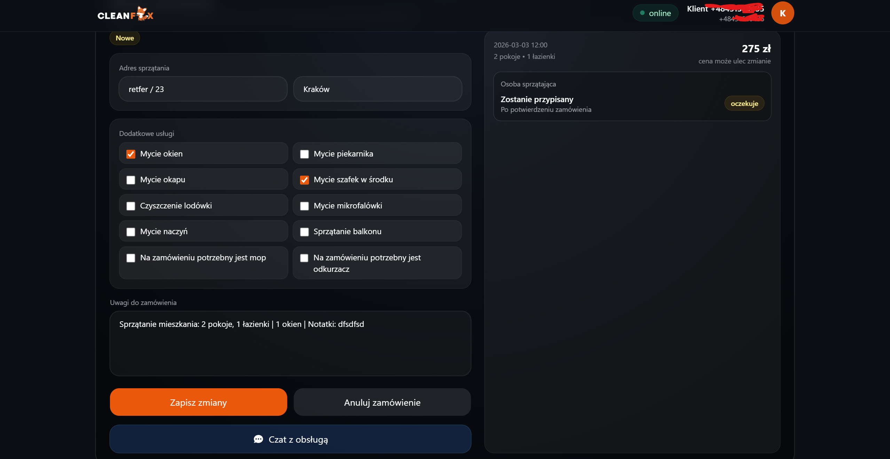
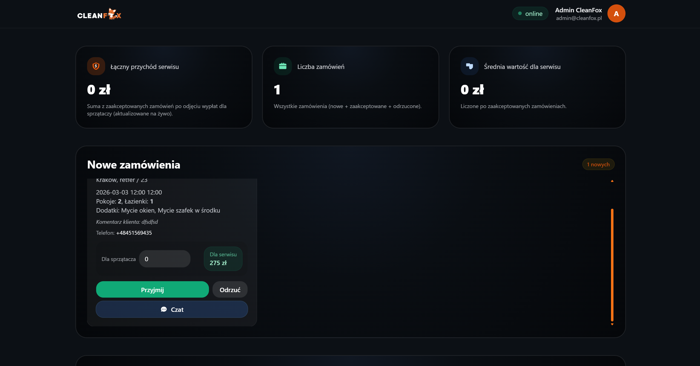
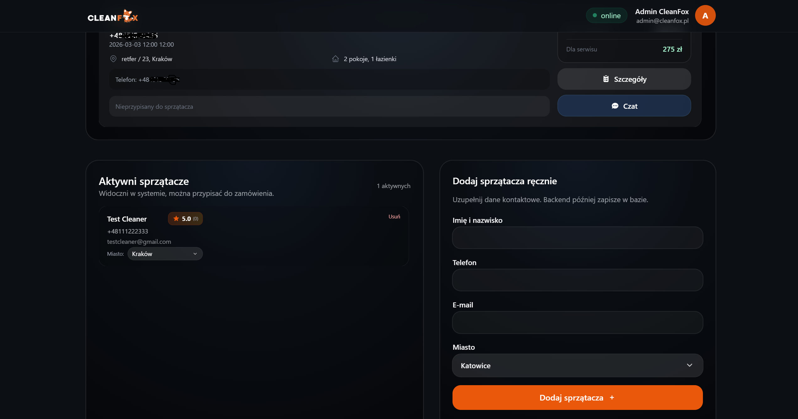
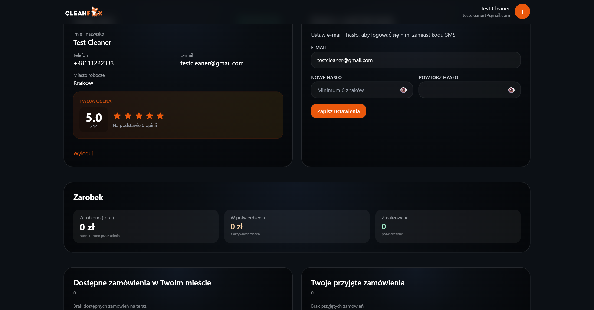

# 🦊 CleanFox – Komercyjna Platforma E-commerce i Marketplace dla Usług Sprzątających


> **Produkcyjna Aplikacja Full-Stack (MERN) / Portfolio Projektowe**  
> CleanFox to w 100% samodzielnie zaprojektowana i zaprogramowana platforma typu _two-sided marketplace_, łącząca osoby poszukujące usług domowych i biurowych (B2C & B2B) z profesjonalnymi wykonawcami. Projekt rozwiązuje realne problemy rynku usług, eliminując asymetrię informacji poprzez cyfryzację rezerwacji, natychmiastowe i rzetelne wyceny (dynamiczny kalkulator) oraz przejrzysty proces zarządzania zamówieniami.
> 
> 🔗 **Adres produkcyjny:** https://clean-fox.pl/

*Uwaga: Ten wgląd do repozytorium prezentuje zakres logiki biznesowej i architektury projektu stworzonego ze względów demonstracyjnych i aplikacyjnych.*

---

## 🎯 Kontekst Biznesowy i Architektura Systemu

System został zaprojektowany wokół scentralizowanej logiki e-commerce opartej na modelu prowizyjnym. W tradycyjnym wariancie rynkowym klienci mierzą się z nieprzejrzystym cennikiem oraz długim czasem oczekiwania. CleanFox wprowadza **dynamiczne taryfikowanie usług na podstawie konfiguracji zamówienia**, zarządzając jednoczesnym rozliczeniem dwóch stron transakcji:
1. **Klient** widzi i opłaca przeliczony koszt usługi.
2. System automatycznie kalkuluje potrąconą zdefiniowaną **prowizję platformy (Service Fee)**.
3. **Wykonawca (Sprzątacz)** widzi dokładnie wirtualne saldo i stawkę równe wypracowanej kwocie netto.

**Architektura** oparta jest o zunifikowane środowisko JavaScript (**MERN Stack**). Całość API została zbudowana w stylu REST z silnym naciskiem na bezpieczeństwo oraz efektywne zarządzanie asynchronicznością, podczas gdy interfejs użytkownika korzysta z responsywnego `React` i `Tailwind CSS`.

---

## 🛠️ Stos Technologiczny

**Frontend (Klient)**
- **React.js 18** zoptymalizowany przez **Vite** dla maksymalnej wydajności budowania.
- **Tailwind CSS** (Mobile-first, z dedykowanymi Custom Utility Classes dbającymi o rygorystyczny design system).
- **React Router DOM** do inteligentnego zarządzania ścieżkami (Routing z podziałem na role).

**Backend (API & Serwer)**
- **Node.js** + **Express.js** jako szkielet warstwy middleware.
- **Mongoose / MongoDB** (NoSQL idealny dla dynamicznego schematu koszyka zamówień i szczegółów usług).
- **JSON Web Tokens (JWT) & bcrypt** do kryptograficznego zarządzania sesjami.
- Integracja z API **Twilio** do globalnej dystrybucji i weryfikacji kodów One-Time-Password (OTP) za pomocą wiadomości SMS.
- System mailingowy wykorzystujący **Nodemailer** i bezpieczne protokoły. 

---

## 🚀 Kluczowe Funkcjonalności (Mechanizmy RBAC)

Aplikacja operuje na trzech separowanych widokach i poziomach uprawnień (**Role-Based Access Control**):

### 🛒 Moduł Klienta (Rezerwacja Usług)
- **Dynamiczny Kalkulator Usług:** Asynchroniczne wyliczanie cen na podstawie skomplikowanych macierzy wejściowych, obsługujący uwarunkowania takie jak relacja metrażu, zniżki na częstotliwość (Subskrypcyjne czyszczenie) i usługi dodatkowe (mycie okien etc.).
- **Proces Autoryzacji Passwordless:** Symulacja bezpiecznego logowania za pomocą prawdziwych kodów OTP (Twilio) przesyłanych przez SMS. Drastycznie zwiększa to konwersję (CRO) dzięki eliminacji żmudnych formularzy do uzupełniania z hasłami.
- **Smart Booking System:** Możliwość inteligentnego zamawiania pod wskazany adres oraz podgląd geolokalizacji wykonawców.
- **Zintegrowany System Wiadomości:** System komunikacji między klientem, a przypisanym zleceniobiorcą, z powiązanymi identyfikatorami zamówień.

### 🧹 Moduł Wykonawcy (Dashboard Pracowniczy)
- **Moduł Dostępności (Marketplace):** Dostęp do agregowanej listy oczekujących ("wolnych") zamówień w obrębie danego miasta. Wykonawca może zatwierdzić zlecenie ("przejąć je") jednym kliknięciem.
- **Zarządzanie Statusami:** Prosty lejek operacyjny: *Zaakceptowane -> W trakcie realizacji -> Oczekujące na ukończenie*.
- **Dashboard Finansowy:** Przejrzysty wgląd w zrealizowane usługi, wyliczenia salda na podstawie ustalonej stawki `cleaner_payout` wobec kwoty uiszczonej przez klienta.

### 👑 Moduł Administratora (Back-Office)
- **Analityka Agregacyjna na Żywo:** Dashboard biznesowy renderujący złożone statystyki finansowe (prowizje platformy, generowane przychody i dystrybucję zarobków).
- **Zarządzanie Obiegiem Pracy:** Pełna weryfikacja wszystkich encji (Klienci, Sprzątacze, Zamówienia), swobodne przepisywanie kontraktów, nadpisywanie cen i statusów. Dowodzenie systemem odbywa się na bazie bezpiecznej sesji JWT.

---

## 🗄️ Inżynieria Danych i Optymalizacja Zapytań (MongoDB)

Struktura bazy danych została bezkompromisowo zoptymalizowana pod kątem redukcji czasu odczytu (`Read Latency`) oraz utrzymania elastyczności na potrzeby przyszłych pivotów w biznesie. Projekt wykorzystuje zaawansowany **MongoDB Aggregation Pipeline**.

### Zaawansowane Przetwarzanie Backendowe w Bazie Danych
Zamiast manipulować dużymi ilościami danych z instancji V8 Node.js, obciążające operacje i obliczenia KPI finansowych dokonywane są natywnie w silniku zapytania:

```javascript
// Agregacje generujące złożone statystyki przychodów CleanFox wewnątrz Mongoose
const result = await Order.aggregate([
    {
      $group: {
        _id: null,
        total_orders: { $sum: 1 },
        revenue_sum: {
          $sum: {
            $cond: [
              { $in: ['$status', ['approved', 'done_waiting', 'completed']] },
              { $subtract: ['$price', '$cleaner_payout'] }, // Obliczenie zysku "w locie"
              0
            ]
          }
        }
      }
    }
]);
```

### Mechanizmy Walidacyjne i Ochrona Logiki Biznesowej
Model Danych (Schema) korzysta ze skrupulatnie skonfigurowanego mapowania po stronie serwera – dba on o to by "cena do wypłaty dla pracownika" vs "odprowadzana prowizja systemu" zawsze były poprawne pod rygorem rzucenia błędem `unsupported-status` lub zablokowania przepływu danych. Wszelkie kluczowe filtry wyszukiwań i formatowanie walut odizolowano logiką serwisów i bezpiecznie udostępniono front-endowi. 

<details>
  <summary>📸 Zobacz zrzuty ekranu aplikacji (Kliknij, aby rozwinąć)</summary>

  ### Strona główna 
  

  ### Formularz zamówień usług sprzątania
  

  ### Strona zarządzania produktami przez administratora
  

  ### Chat z klientem
  

  ### Panel administratora
  
  
  

  ### Panel sprzątacza
  
</details>
